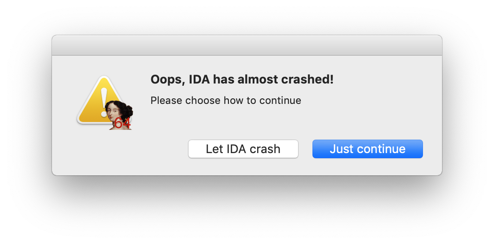

# IDA7.0CarchFixForInputMethod-macOS

### 说明
* **Mac 系统升级到10.14.1后，打开IDA时出现以下问题：**

* **修复IDA7.0 Mac 版本在非英文输入法Carch的问题**

### 使用命令

* **cd ~/Downloads && git clone https://github.com/ThomasShuYe/IDA7.0CarchFixForInputMethod-macOS.git && ./IDA7.0CarchFixForInputMethod-macOS/IDA7.0FixCarch.sh**

